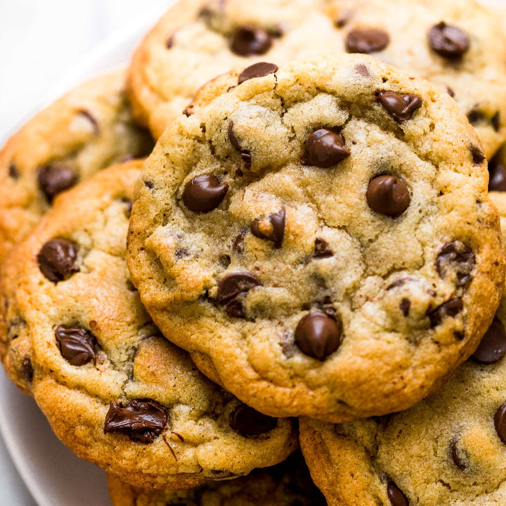

# Open-source-Cookies
Open source delightful cookies for everyone.
---

---
### Requirements :
| :warning: WARNING          |
|:---------------------------|
| Only avalaible for Windows 8.1 eor higher and any Linux distributions|

* Egg: 1
* Sugar: 85 g
* Unsalted butter: 85 g
* Flour: 150 g
* Chocolate chips: 100 g
* Vanilla sugar: 1 sachet
* Baking powder: 1 tsp
* Salt: ½ tsp

### Building instruction:
1. Let the butter soften to room temperature. In a bowl, cream it with the sugar.
2. Add the egg and vanilla sugar (if using).
3. Gradually add the flour, baking powder, salt, and chocolate chips. Mix well.
4. Grease a baking sheet or line it with a silicone mat. Using two tablespoons or simply your hands, form balls of dough, spacing them apart as they will spread during baking.

#### To finish
Bake for 8 to 10 minutes at 180°C (350°F) or gas mark.
Remove them from the oven as soon as the edges begin to brown.

---

## Contributing :
The contributions are highly appreciated !
